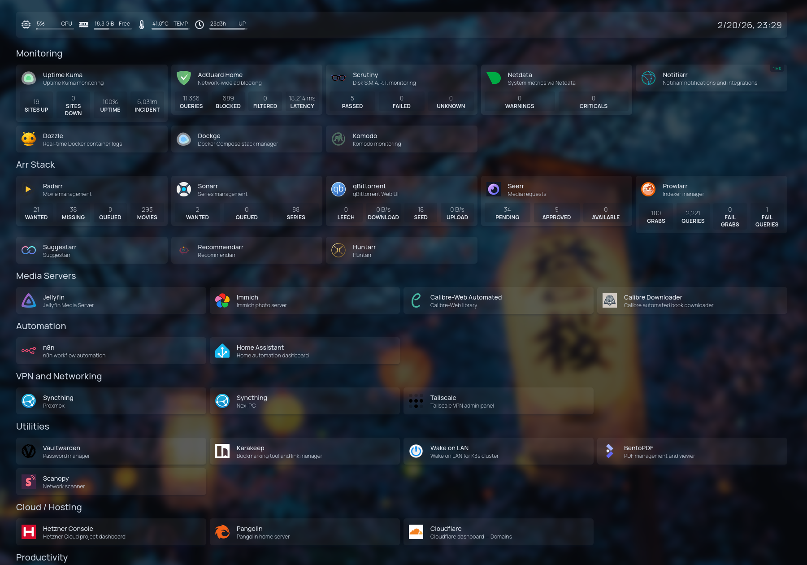

# Homelab Infrastructure

[](https://www.proxmox.com/)
[](https://www.docker.com/)
[](https://komo.do/)
[]()

Self-hosted infrastructure running 27 services on Proxmox VE. Built from scratch to learn Linux, networking, and DevOps practices.

## 🛠️ Tech Stack

| Category | Tools |
|----------|-------|
| Hypervisor | Proxmox VE 9.1 |
| Containers | Docker, LXC |
| Management | Komodo |
| Storage | MergerFS + SnapRAID (8.1TB) |
| Backup | Restic (local, NFS, cloud) |
| Reverse Proxy | Pangolin (self-hosted tunnel) |
| VPN | Tailscale |
| DNS | AdGuard Home |
| Monitoring | Scrutiny, Uptime Kuma, Dozzle, Netdata |

## 🏗️ Architecture

```
Proxmox VE 9.1 (pve)
├── LXC 100 (docker-host) [running]
├── LXC 102 (adguard-home) [running]
├── LXC 103 (alpine-vaultwarden) [running]
├── LXC 104 (scanopy) [running]
├── LXC 105 (alpine-komodo) [running]
├── LXC 106 (karakeep) [running]
├── LXC 107 (n8n) [running]
├── LXC 108 (ollama) [running]
├── VM  101 (haos-16.3) [running]
└── Storage
    ├── backup-hdd (dir) [available]
    │   ├── Used:      2.399 TiB
    │   └── Available: 8.098 TiB
    └── local (dir) [available]
        ├── Used:      17.686 GiB
        └── Available: 58.758 GiB

Nobara PC
└── Desktop services (Open WebUI, AnythingLLM)

K3s Cluster (Planned)
└── 3x Dell OptiPlex nodes (5060, 3060, 3050)
```

## 📸 Dashboard



## 🚀 Featured Projects

### Automated Docker Stack Migration
Migrated 20 Docker Compose stacks from Dockge to Komodo with zero downtime. Built an automated import workflow (Docker → TOML → Komodo) for centralized management and Git-based version control of all stack configs.

📖 [Full Documentation →](./docs/proxmox/17_Komodo_complete_setup.md)

### Resilient Storage Architecture
Pooled 4 disks into a single MergerFS volume with SnapRAID parity protection. Automated sync and scrub via systemd timers. Can survive 1 disk failure with no data loss.

📖 [Storage Setup Guide →](./docs/proxmox/01_Proxmox_VE_9.1_MergerFS_SnapRAID_Installation_Documentation.md)

### Infrastructure as Code
All services version-controlled as Docker Compose files. Secrets in gitignored `.env` files, templates committed as `.env.example`. Full infrastructure rebuild in under 2 hours.

📖 [Compose Files →](./compose/)

## 📚 Documentation

- [Proxmox Initial Setup + Storage](./docs/proxmox/01_Proxmox_VE_9.1_MergerFS_SnapRAID_Installation_Documentation.md)
- [LXC & Docker Setup](./docs/proxmox/02_Proxmox_Docker_LXC_Setup_-_Detailed_Process.md)
- [Komodo Installation & Configuration](./docs/proxmox/17_Komodo_complete_setup.md)
- [Backup System](./docs/proxmox/16_Proxmox_Backup_System_Documentation.md)
- [VPS + Pangolin Reverse Proxy](./docs/vps/Hetzner_VPS_+_Pangolin_+_Jellyfin_Complete_Setup_Guide.md)
- [Security Configuration](./docs/proxmox/12_Security_Configuration_Guide.md)
- [Immich Photo Management](./docs/proxmox/06_Immich_Setup_Full_Installation_Guide.md)
- [Jellyfin Hardware Transcoding](./docs/proxmox/11_Jellyfin_Hardware_Transcoding_Setup.md)
- [AdGuard Home + Tailscale DNS](./docs/proxmox/05_AdGuard_Home_Setup_Dedicated_LXC_Tailscale_DNS_Integration.md)
- [Karakeep, n8n, Ollama LXCs](./docs/proxmox/10_Helper_Script_LXCs.md)

## 🛣️ Roadmap

- [ ] Migrate select services to K3s Kubernetes cluster
- [ ] Implement GitOps workflow with ArgoCD
- [ ] Add Ansible for configuration management
- [ ] Set up Grafana + Prometheus monitoring stack

## 📬 Contact

- **LinkedIn**: [Norbert Csicsay](https://www.linkedin.com/in/norbert-csicsay-497195334)
- **GitHub**: [Pironex9](https://github.com/Pironex9)

---

<sub>Last updated: February 2026 | Infrastructure: Proxmox VE 9.1 | Services: 27 active (19 Docker stacks + 8 LXC/VM)</sub>
