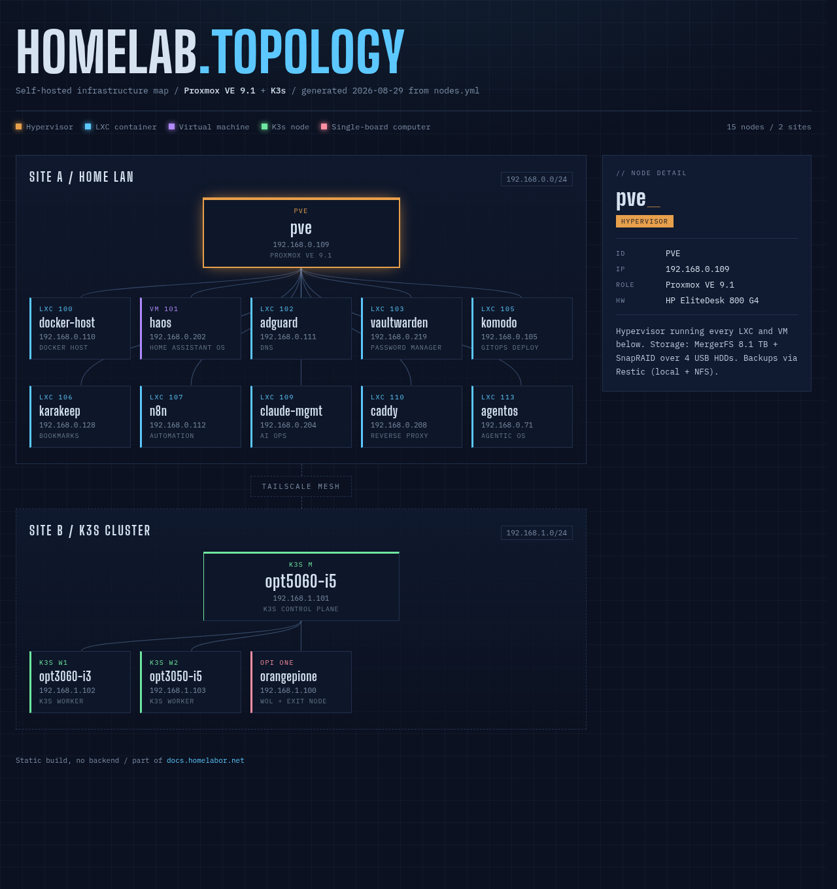
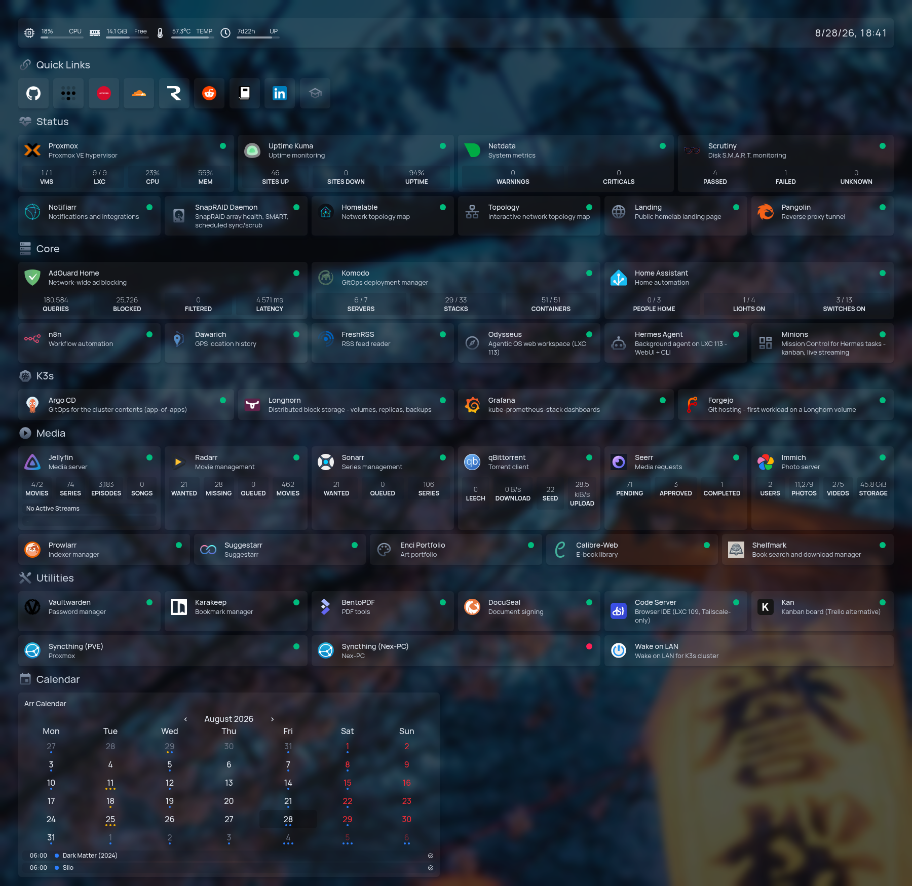

# Homelab Infrastructure

Self-hosted infrastructure running 32 Docker Compose stacks across 10 Proxmox guests and a 3-node K3s cluster on a second site. Built from scratch to learn Linux, networking, and DevOps practices.

Everything here is version-controlled: the Compose stacks, the K3s cluster contents (Argo CD app-of-apps), the cluster's own config layer (Ansible), and the backup verification scripts. Published as a portfolio at [docs.homelabor.net](https://docs.homelabor.net).

## 🛠️ Tech Stack

| Category | Tools |
|----------|-------|
| Hypervisor | Proxmox VE 9.1 |
| Containers | Docker, LXC |
| Orchestration | K3s v1.36.4 (3 nodes), Longhorn v1.12.1 |
| GitOps | Komodo (Compose), Argo CD v3.5.1 (K3s) |
| Config management | Ansible (`k3s-io/k3s-ansible`) |
| Storage | MergerFS + SnapRAID (8.1TB) |
| Backup | Restic (local disk + NFS), gpg-encrypted K3s control-plane dumps, Longhorn to Garage S3 |
| Reverse Proxy | Pangolin (public), Caddy (local .lan HTTPS), Tailscale operator Ingress (K3s) |
| VPN | Tailscale |
| DNS | AdGuard Home |
| Monitoring | kube-prometheus-stack (K3s), Scrutiny, Uptime Kuma, Netdata |

## 🏗️ Architecture

## 📸 Dashboard

## 🚀 Featured Projects

### Automated Docker Stack Migration
Migrated 20 Docker Compose stacks from Dockge to Komodo with zero downtime. Built an automated import workflow (Docker → TOML → Komodo) for centralized management and Git-based version control of all stack configs.

📖 [Full Documentation →](./docs/proxmox/16_Komodo_complete_setup.md)

### Resilient Storage Architecture
Pooled 4 disks into a single MergerFS volume with SnapRAID parity protection. Automated sync and scrub via systemd timers. Can survive 1 disk failure with no data loss.

📖 [Storage Setup Guide →](./docs/proxmox/01_Proxmox_VE_9.1_MergerFS_SnapRAID_Installation_Documentation.md)

### Infrastructure as Code
All services version-controlled as Docker Compose files. Secrets in gitignored `.env` files, templates committed as `.env.example`. Full infrastructure rebuild in under 2 hours.

📖 [Compose Files →](./compose/)

### Kubernetes, Declared in Git
A 3-node K3s cluster whose contents are an Argo CD app-of-apps: Longhorn storage, kube-prometheus-stack, the system-upgrade controller that does the k3s version bumps, and Forgejo as the first stateful workload on a Longhorn volume. Secrets are encrypted at rest, the `apps` namespace runs under a default-deny NetworkPolicy, and the cluster's own config layer (k3s args, unit files) is described by Ansible against the running cluster rather than a rebuild.

📖 [Cluster contents →](./k8s/README.md) · [Config layer →](./ansible/README.md) · [Host reference →](./docs/hosts/k3s-cluster.md)

### Backups That Are Proven, Not Assumed
A weekly job restores a Restic snapshot to a scratch directory and compares checksums; the K3s control plane is dumped and gpg-encrypted daily, and both the control-plane restore and a Longhorn volume restore have been carried out end to end, not just decrypted. Every job pings an Uptime Kuma push monitor, so a run that silently stops running raises an alert.

📖 [Backup layout and restore proofs →](./scripts/README.md)

## 📚 Documentation

**Host reference** (current config, services, lessons learned):
- [docker-host](./docs/hosts/docker-host.md) · [adguard](./docs/hosts/adguard.md) · [komodo](./docs/hosts/komodo.md) · [karakeep](./docs/hosts/karakeep.md) · [n8n](./docs/hosts/n8n.md) · [haos](./docs/hosts/haos.md) · [claude-mgmt](./docs/hosts/claude-mgmt.md) · [caddy](./docs/hosts/caddy.md) · [agentos](./docs/hosts/agentos.md) · [k3s-cluster](./docs/hosts/k3s-cluster.md) · [vps](./docs/hosts/vps.md) · [nobara](./docs/hosts/nobara.md) · [winpc](./docs/hosts/winpc.md)

**Infrastructure as code** (the directories, each with its own README):
- [`compose/`](./compose/) - 32 Compose stacks · [`k8s/`](./k8s/README.md) - Argo CD app-of-apps · [`ansible/`](./ansible/README.md) - K3s config layer · [`scripts/`](./scripts/README.md) - backup and restore verification

**Setup guides** (how it was built):
- [Proxmox Initial Setup + Storage](./docs/proxmox/01_Proxmox_VE_9.1_MergerFS_SnapRAID_Installation_Documentation.md)
- [LXC & Docker Setup](./docs/proxmox/02_Proxmox_Docker_LXC_Setup_-_Detailed_Process.md)
- [Komodo Installation & Configuration](./docs/proxmox/16_Komodo_complete_setup.md)
- [Backup System](./docs/proxmox/15_Proxmox_Backup_System_Documentation.md)
- [VPS + Pangolin Reverse Proxy](./docs/vps/01_Hetzner_VPS_Pangolin_Jellyfin_Setup.md)
- [Security Configuration](./docs/vps/02_Security_Configuration_Guide.md)
- [Immich Photo Management](./docs/proxmox/06_Immich_Setup_Full_Installation_Guide.md)
- [Jellyfin Hardware Transcoding](./docs/proxmox/11_Jellyfin_Hardware_Transcoding_Setup.md)
- [AdGuard Home + Tailscale DNS](./docs/proxmox/05_AdGuard_Home_Setup_Dedicated_LXC_Tailscale_DNS_Integration.md)
- [Karakeep, n8n, Ollama LXCs](./docs/proxmox/10_Helper_Script_LXCs.md)
- [Backup Verification + Restore Test](./docs/proxmox/30_Backup_Verification_Restore_Test.md)

## 🛣️ Roadmap

- [x] Migrate Docker stack management to Komodo GitOps
- [x] K3s Kubernetes cluster (3x Dell OptiPlex)
- [x] Longhorn storage for K3s, with a restore proven end to end
- [x] Prometheus + Grafana monitoring for K3s
- [x] Argo CD GitOps for K3s workloads
- [x] Ansible for the cluster's configuration layer
- [x] First stateful workload on the cluster (Forgejo on a Longhorn volume)
- [ ] Second NVMe in the hypervisor, to end the recurring `pve/data` thin pool squeeze
- [ ] Migrate the docs site off Material for MkDocs before its 2026-11-05 EOL

## 📬 Contact

- **LinkedIn**: [Norbert Csicsay](https://www.linkedin.com/in/norbert-csicsay-497195334)
- **GitHub**: [Pironex9](https://github.com/Pironex9)

---

Last updated: August 2026 | Infrastructure: Proxmox VE 9.1 + K3s v1.36.4 | Services: 32 Compose stacks + 10 Proxmox guests + 3-node K3s cluster
