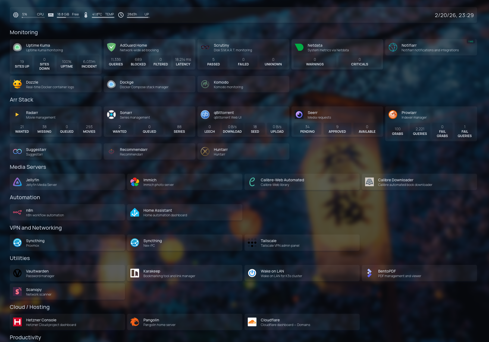

**Date:** 2026-03-14
**Author:** Norbert Csicsay
**GitHub:** [Pironex9/homelab](https://github.com/Pironex9/homelab)

---

# Homelab Infrastructure

Self-hosted infrastructure running 27 services on Proxmox VE. Built from scratch to learn Linux, networking, and DevOps practices.

## Tech Stack

| Category | Tools |
|----------|-------|
| Hypervisor | Proxmox VE 9.1 |
| Containers | Docker, LXC |
| Management | Komodo |
| Storage | MergerFS + SnapRAID (8.1TB) |
| Backup | Restic (local disk + NFS to Nobara PC) |
| Reverse Proxy | Pangolin (self-hosted tunnel) |
| VPN | Tailscale |
| DNS | AdGuard Home |
| Monitoring | Scrutiny, Uptime Kuma, Dozzle |

## Architecture

```
Proxmox VE 9.1 (HP EliteDesk 800 G4, i5-8400, 32GB RAM)
├── LXC 100  docker-host     192.168.0.110   18 Docker Compose stacks
├── VM  101  haos            192.168.0.202   Home Assistant OS
├── LXC 102  adguard         192.168.0.111   AdGuard Home + Tailscale DNS
├── LXC 103  vaultwarden     -               Vaultwarden password manager
├── LXC 104  scanopy         -               Scanopy document scanner
├── LXC 105  komodo          192.168.0.105   Komodo GitOps management
├── LXC 106  karakeep        192.168.0.128   Karakeep bookmarking + AI tagging
├── LXC 107  n8n             192.168.0.112   n8n workflow automation
├── LXC 108  ollama          192.168.0.231   Ollama local LLM (CPU, always on)
├── LXC 109  claude-mgmt     192.168.0.204   Claude Code management node
└── Storage
    ├── MergerFS pool   8.1TB usable (4x USB HDD)
    └── SnapRAID        1 parity drive, automated sync + scrub

Nobara PC (192.168.0.100)
└── Open WebUI + AnythingLLM + Ollama (GPU, not 24/7)

Hetzner VPS (FSN1)
├── Pangolin reverse proxy  (public access)
└── Traefik + WireGuard tunnel to homelab

K3s Cluster (planned)
└── 3x Dell OptiPlex nodes (5060, 3060, 3050)
```

## Docker Services (LXC 100)

18 active stacks: bentopdf, calibre-web-automated, dockge, dozzle, docuseal, freshrss, homepage, immich, jellyfin, notifiarr, prowlarr, qbittorrent, radarr, scrutiny, seerr, sonarr, suggestarr, syncthing, uptime-kuma

## Dashboard



## Featured Projects

### Komodo GitOps Migration
Migrated 20 Docker Compose stacks from Dockge to Komodo with zero downtime. All stacks now version-controlled in Git; Komodo pulls and deploys from the repo.

[Full Documentation](proxmox/16_Komodo_complete_setup.md)

### Resilient Storage
Pooled 4 USB HDDs into a single MergerFS volume with SnapRAID parity. Can survive 1 disk failure with no data loss. Automated sync via systemd timers.

[Storage Setup Guide](proxmox/01_Proxmox_VE_9.1_MergerFS_SnapRAID_Installation_Documentation.md)

### Self-hosted Tunnel (Pangolin)
Public access to self-hosted services via Pangolin on a Hetzner VPS - no Cloudflare dependency, no port forwarding.

[VPS + Pangolin Guide](vps/01_Hetzner_VPS_Pangolin_Jellyfin_Setup.md)

### Backup System
Restic backups to local disk, NFS share, and Backblaze B2. Automated via shell script + systemd timers. Multiple retention policies.

[Backup System Documentation](proxmox/15_Proxmox_Backup_System_Documentation.md)

## Navigation

- **Hosts** - Current configuration, running services, and notes for each LXC/VM
- **Setup Guides** - Chronological guides documenting how the homelab was built
- **VPS** - Hetzner VPS and Pangolin reverse proxy setup

## Contact

- **LinkedIn**: [Norbert Csicsay](https://www.linkedin.com/in/norbert-csicsay-497195334)
- **GitHub**: [Pironex9](https://github.com/Pironex9)
